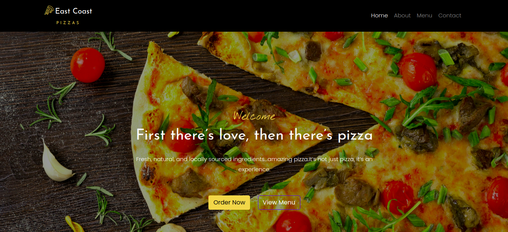

# EAST COAST PIZZAS
### 31.07.2020
#### This is a fictional pizza ordering website

#### By **DENNIS KAMUNYA**
## Versioning
East Coast Pizzas V1.0
## Description
East Coast Pizzas is a fictional pizza shop located in the Hub, Nairobi with a web application which allows users to make orders. The app has a variety of pizzas to choose from with various options of size, toppings and crust. The user can also request for delivery of the pizza and can order as many pizzas as he or she wishes. The link to the live site is https://d-kamunya.github.io/East-Coast-Pizzas/
## Features
Here are the features in summary:
* Selection of size of pizza.
* Selection of choice of toppings.
* Selection of choice of crust.
* Opting to have the pizza delivered or picked up.
* Ability to order more than one pizza.
## Behaviour Driven Development (BDD)
|Behaviour 	           |    Input 	                 |       Output          |
|----------------------------------------------|:-----------------------------------:|-----------------------------:|       
|Page loads, clicking on order button on the navbar and a modal with a form containing options for size, crust, toppings and delivery                                   |   User selects the pizza details he would like to order   |A price breakdown and grand total price will appear   |  
## Setup/Installation Requirements
* git clone https://github.com/D-Kamunya/East-Coast-Pizzas.git
* fork github repo

## Technologies Used
* HTML
* CSS
* JAVASCRIPT
* BOOTSTRAP
* JQUERY
## Contribution
Pull requests are welcome. For major changes, please open an issue first to discuss what you would like to change.
## Support and contact details
If you run into any problems feel free to contact me @dennismuriithik@gmail.com
#### License

Permission is hereby granted, free of charge, to any person obtaining a copy of this software and associated documentation files (the "Software"), to deal in the Software without restriction, including without limitation the rights to use, copy, modify, merge, publish, distribute, sublicense, and/or sell copies of the Software, and to permit persons to whom the Software is furnished to do so, subject to the following conditions:

The above copyright notice and this permission notice shall be included in all copies or substantial portions of the Software.

THE SOFTWARE IS PROVIDED "AS IS", WITHOUT WARRANTY OF ANY KIND, EXPRESS OR IMPLIED, INCLUDING BUT NOT LIMITED TO THE WARRANTIES OF MERCHANTABILITY, FITNESS FOR A PARTICULAR PURPOSE AND NONINFRINGEMENT. IN NO EVENT SHALL THE AUTHORS OR COPYRIGHT HOLDERS BE LIABLE FOR ANY CLAIM, DAMAGES OR OTHER LIABILITY, WHETHER IN AN ACTION OF CONTRACT, TORT OR OTHERWISE, ARISING FROM, OUT OF OR IN CONNECTION WITH THE SOFTWARE OR THE USE OR OTHER DEALINGS IN THE SOFTWARE.

Copyright (c) 2020 Dennis Kamunya

  